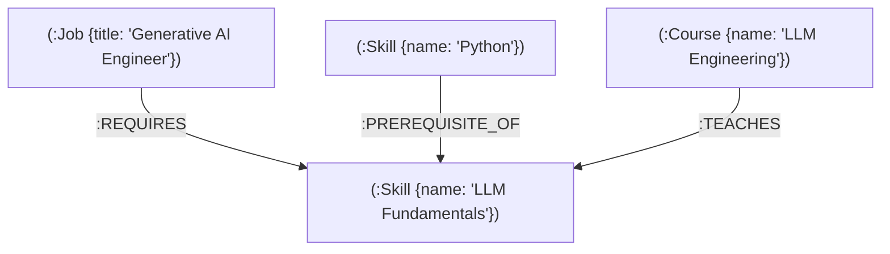

# SkillPath — AI Career Knowledge Graph & Skill Roadmap Engine

**SkillPath** is a graph-powered AI career intelligence platform that analyzes software engineering career destinations, maps prerequisite skill dependency trees, calculates dynamic career readiness scores, and visualizes complex technical skill networks in interactive 3D WebGL.

---

## 🎯 1. Purpose & Problem Statement

Navigating modern software developer career paths is complicated by non-linear skill dependencies. Relational SQL databases struggle to efficiently calculate multi-hop prerequisite chains (e.g., `Python` → `Machine Learning` → `Deep Learning` → `LLM Fundamentals` → `RAG`), requiring expensive recursive CTEs and multiple joins.

**SkillPath** solves this by modeling technical careers, skills, and course recommendations as a native **Graph Data Structure** in **Neo4j / CognoDB**. Using Cypher's `shortestPath()` and variable-length pattern matching (`-[:PREREQUISITE_OF*1..10]->`), SkillPath instantly evaluates a developer's current skill profile against target job requirements, identifies exact missing prerequisites, and generates an optimal, step-by-step learning roadmap.

---

## 🌟 2. Key Features

- **3-Step Career Planner**: Select a target role (e.g., *Generative AI Engineer*, *Backend Developer*), select mastered skills, and calculate a real-time readiness match percentage.
- **Dynamic Learning Path Engine**: Calculates missing required skills, resolves multi-hop prerequisite dependencies, and estimates total learning duration using Cypher graph traversals.
- **Interactive Prerequisite Roadmap**: Chronological step-by-step timeline rendering origin skills, prerequisite steps, individual prerequisite chips, target destination metrics, and mapped courses.
- **Flagship 3D WebGL Knowledge Graph**: Code-split Three.js / WebGL 3D network visualization with emissive nodes, curved relationship edges, category filtering, search focus, orbit controls, camera transitions, and a scrollable Node Inspector panel.
- **Career Explorer & Skill Directories**: Searchable directories of software engineering roles and indexed technical skills with level filters and interactive mastery state toggling.
- **Curated Course Library**: Graph-mapped course recommendations derived from `(:Course)-[:TEACHES]->(:Skill)` relationships.
- **Collapsible Navigation & Mobile Drawer**: Collapsible desktop sidebar rail (248px → 68px icon rail) and mobile/tablet slide-in navigation drawer with glass backdrop overlay.

---

## 🛠️ 3. Technology Stack

- **Frontend**: React 18, Vite, Three.js, OrbitControls, Vanilla CSS Design System (CSS Tokens, CSS Grid, Flexbox).
- **Backend API**: Node.js, Express.js (3-tier Route → Service → Query architecture).
- **Database**: Neo4j / CognoDB Graph Database over secure Bolt protocol (`bolt+s://`).
- **Database Driver**: Official `neo4j-driver` (`^6.2.0`).
- **Query Language**: Parameterized Cypher (`$targetJob`, `$currentSkills`, `$skill`).

---

## 🏗️ 4. System Architecture

```
┌─────────────────────────────────────────────────────────┐
│                    SkillPath Frontend                   │
│      React 18 + Vite + 3D WebGL (Three.js Engine)       │
└───────────────────────────┬─────────────────────────────┘
                            │ REST API (JSON)
                            ▼
┌─────────────────────────────────────────────────────────┐
│                  Express.js Backend API                 │
│      routes/  ──►  services/  ──►  queries/             │
└───────────────────────────┬─────────────────────────────┘
                            │ Official neo4j-driver (Bolt)
                            ▼
┌─────────────────────────────────────────────────────────┐
│                 Neo4j / CognoDB Database                │
│    (:Job) ──[:REQUIRES]──► (:Skill) ◄──[:TEACHES]── (:Course)
│                              ▲                          │
│                              └─────[:PREREQUISITE_OF]───┘
└─────────────────────────────────────────────────────────┘
```

---

## 🕸️ 5. Graph Data Model & Seed Counts

The database schema models technical skills and careers as a directed acyclic graph (DAG):



### Node Labels & Properties
- **`:Job`**: `title` (Unique), `level`, `industry`
- **`:Skill`**: `name` (Unique), `category`, `level`
- **`:Course`**: `name` (Unique), `provider`, `level`, `duration_hours`
- **`:Certification`**: `name` (Unique constraint)

### Relationship Types
- `(:Job)-[:REQUIRES]->(:Skill)` — Defines required skills for a target career role.
- `(:Skill)-[:PREREQUISITE_OF]->(:Skill)` — Defines foundational prerequisite requirements between skills.
- `(:Course)-[:TEACHES]->(:Skill)` — Maps educational course content to target skills.

### Seed Dataset Audit Counts (from `scripts/seed.cypher`)
- **Jobs**: 15 indexed roles (*Generative AI Engineer*, *Backend Developer*, *Full Stack Developer*, *DevOps Engineer*, *Data Analyst*, etc.)
- **Skills**: 41 technical skills across 7 categories (*Programming*, *Web Development*, *Data*, *AI/ML*, *Developer Tools*, *DevOps*, *Security*).
- **Courses**: 28 structured courses with provider, duration, and level metadata.
- **Skill Prerequisites (`PREREQUISITE_OF`)**: 34 directed prerequisite edges.
- **Job Requirements (`REQUIRES`)**: 98 requirement edges.
- **Course Coverage (`TEACHES`)**: 38 teaching edges.

---

## ⚡ 6. Graph-Based Learning-Path Logic (Cypher)

The core path calculation engine executes a single multi-hop Cypher query (`FIND_LEARNING_PATH`) that identifies missing required skills, finds the shortest prerequisite path from known/root skills, and attaches relevant course recommendations:

```cypher
MATCH (j:Job {title: $targetJob})-[:REQUIRES]->(target:Skill)
WHERE NOT target.name IN $currentSkills

OPTIONAL MATCH pKnown = shortestPath((start:Skill)-[:PREREQUISITE_OF*1..10]->(target))
WHERE start.name IN $currentSkills

OPTIONAL MATCH pRoot = shortestPath((root:Skill)-[:PREREQUISITE_OF*1..10]->(target))
WHERE NOT ()-[:PREREQUISITE_OF]->(root) AND NOT root.name IN $currentSkills

OPTIONAL MATCH (anyPrereq:Skill)-[:PREREQUISITE_OF]->(target)

WITH target, anyPrereq IS NOT NULL AS hasPrereqs,
     CASE 
       WHEN pKnown IS NOT NULL THEN pKnown 
       WHEN pRoot IS NOT NULL THEN pRoot
       ELSE NULL 
     END AS path

WITH target, hasPrereqs, path
ORDER BY CASE WHEN path IS NOT NULL THEN length(path) ELSE 999 END ASC

WITH target, hasPrereqs, head(collect(path)) AS bestPath

OPTIONAL MATCH (course:Course)-[:TEACHES]->(target)

RETURN
  target.name AS targetSkill,
  hasPrereqs,
  CASE 
    WHEN bestPath IS NOT NULL THEN [n IN nodes(bestPath) | n.name]
    ELSE [target.name]
  END AS learningChain,
  CASE 
    WHEN bestPath IS NOT NULL THEN length(bestPath)
    ELSE 0
  END AS hops,
  collect(DISTINCT {
    name: course.name,
    provider: course.provider,
    durationHours: course.duration_hours,
    level: course.level
  }) AS courses
ORDER BY hops ASC, targetSkill
```

### Why Neo4j / Graph DB is Superior to Relational SQL
1. **Multi-Hop Traversals**: Graph traversals evaluate variable-length dependencies (`-[:PREREQUISITE_OF*1..10]->`) with efficient index-free adjacency traversals ($O(V+E)$), whereas relational SQL requires deeply nested recursive Common Table Expressions (CTEs) and multi-table joins.
2. **Native Shortest Path Algorithms**: Neo4j built-in `shortestPath()` finds optimal learning paths natively without application-side Dijkstra implementations.
3. **Pattern Matching**: Natural Cypher syntax allows matching complex relationships (`(:Job)-[:REQUIRES]->(:Skill)<-[:TEACHES]-(:Course)`) in a single query.

---

## 📡 7. API Endpoints

All endpoints return structured JSON responses with standard HTTP status codes (`200`, `400`, `404`, `500`).

| HTTP Method | Endpoint | Description | Query / Body Parameters |
|---|---|---|---|
| `GET` | `/api/health` | Backend and service health status | None |
| `GET` | `/api/jobs` | Fetch all software engineering target roles & requirements | None |
| `GET` | `/api/skills` | Fetch all indexed skills with categories and levels | None |
| `POST` | `/api/path` | Calculate dynamic learning path, readiness score & courses | Body: `{ targetJob: string, currentSkills: string[] }` |
| `GET` | `/api/recommendations` | Fetch courses that teach a specific skill | Query: `?skill=Python` |

---

## 🖥️ 8. Frontend Workflow & 7 Application Screens

1. **Dashboard Command Center** (`/`): High-level career overview, active target job telemetry, graph readiness score gauge, and quick-start actions.
2. **Career Planner Workspace** (`/planner`): 3-step target role selector, search & category-filtered skill catalog, live readiness match percentage calculation, and `Build My Learning Path` CTA.
3. **Learning Roadmap Timeline** (`/roadmap`): Prerequisite learning sequence timeline displaying step badges, individual prerequisite chips, target destination metrics, and mapped course recommendations.
4. **Knowledge Graph Workspace** (`/graph`): Flagship 3D WebGL network stage displaying emissive nodes (Skills [violet], Careers [cyan], Courses [green]), curved relationship edges, category filters, graph search, camera controls (+, −, Reset View, Auto-Rotate), and right-side scrollable Node Inspector panel.
5. **Career Explorer Directory** (`/jobs`): Searchable directory grid of target engineering roles with level filters, skill requirement chips, and `Plan This Career →` action links.
6. **Skill Explorer Directory** (`/skills`): Searchable directory grid of technical skills with category filter chips, mastered state toggling, and learning path CTAs.
7. **Technical Course Library** (`/courses`): Mapped course recommendations workspace derived from `learningPath` graph traversal with provider filters and intentional empty states.

---

## 🚀 9. Setup & Installation Instructions

### Prerequisites
- Node.js (v18+ recommended)
- npm (v9+ recommended)
- Live CognoDB or Neo4j Instance (or local Neo4j Desktop / Docker instance)

### 1. Repository Setup & Dependencies
```bash
# Clone the repository
git clone https://github.com/your-org/SkillPath.git
cd SkillPath

# Install backend dependencies
cd backend
npm install

# Install frontend dependencies
cd ../frontend
npm install
```

### 2. Environment Configuration
Create a `.env` file inside the `backend/` directory using `backend/.env.example` as a template:

```ini
NEO4J_URI=bolt+s://db-XXXXX.bravo.databases.cognodb.com
NEO4J_USER=cognodb
NEO4J_PASSWORD=your_secure_password_here
PORT=5000
```
> **Security Note**: Never commit `.env` to source control. `.env` is listed in `.gitignore`.

### 3. Seed Database
Populate your Neo4j / CognoDB instance with jobs, skills, courses, and prerequisite relationships:

```bash
# Run seed loading script from root directory
node scripts/seed-db.js
```

### 4. Run Development Servers
```bash
# Terminal 1: Start Backend API (runs on http://localhost:5000)
cd backend
npm run dev

# Terminal 2: Start Frontend App (runs on http://localhost:5174)
cd frontend
npm run dev
```

---

## 🧪 10. Automated Tests & Validation Scripts

### Backend Test Suite
```bash
# Run Career Readiness Score & Pathfinding Audit Suite
cd backend
node test-engine.js

# Run Graph Integrity Audit (Duplicate edges, cycles, unmapped skills)
node audit-graph.js

# Verify Database Connection
npm run test:db
```

### Frontend Code Checks
```bash
cd frontend

# Run ESLint (Zero errors, zero warnings)
npm run lint

# Production Vite Build Verification
npm run build
```

---

## 📁 11. Project Directory Structure

```
SkillPath/
├── backend/
│   ├── src/
│   │   ├── app.js               # Express application configuration & middleware assembly
│   │   ├── server.js            # Server entry point listening on PORT
│   │   ├── config/
│   │   │   └── env.js           # Environment variable validation
│   │   ├── db/
│   │   │   ├── driver.js        # Neo4j driver initialization
│   │   │   └── health.js        # Database connectivity check
│   │   ├── middleware/
│   │   │   ├── errorHandler.js  # Centralized JSON error handler
│   │   │   └── notFound.js      # 404 route handler
│   │   ├── queries/             # Modular parameterized Cypher queries
│   │   │   ├── jobs.js
│   │   │   ├── skills.js
│   │   │   ├── learningPath.js
│   │   │   ├── courses.js
│   │   │   └── recommendations.js
│   │   ├── services/            # Business logic layer
│   │   │   ├── pathService.js
│   │   │   ├── jobService.js
│   │   │   ├── skillService.js
│   │   │   └── recommendationService.js
│   │   ├── routes/              # Express route controllers
│   │   │   ├── jobs.js
│   │   │   ├── skills.js
│   │   │   ├── path.js
│   │   │   └── recommendations.js
│   │   └── utils/
│   │       └── asyncHandler.js  # Async controller wrapper
│   ├── .env.example
│   ├── package.json
│   ├── test-engine.js           # Readiness score test suite
│   └── audit-graph.js           # Graph integrity audit script
├── frontend/
│   ├── src/
│   │   ├── components/
│   │   │   ├── layout/Sidebar.jsx
│   │   │   ├── graph/KnowledgeGraph3D.jsx
│   │   │   ├── Header.jsx
│   │   │   ├── Dashboard.jsx
│   │   │   ├── CareerPlanner.jsx
│   │   │   ├── LearningRoadmap.jsx
│   │   │   ├── KnowledgeGraph.jsx
│   │   │   ├── CareerExplorer.jsx
│   │   │   ├── SkillExplorer.jsx
│   │   │   ├── CourseLibrary.jsx
│   │   │   └── ui/              # 12 Atomic UI Primitives
│   │   ├── hooks/
│   │   │   └── useSkillPath.js  # Dynamic API state management
│   │   ├── services/
│   │   │   └── api.js           # Axios API client contracts
│   │   ├── App.jsx              # Shell assembly & route switcher
│   │   ├── App.css              # Master CSS grid & design system
│   │   └── main.jsx
│   ├── package.json
│   └── vite.config.js
├── scripts/
│   ├── seed.cypher              # Cypher graph schema & seed statements
│   └── seed-db.js               # Node.js seed execution script
├── backend-audit.md             # Complete forensic backend audit report
└── README.md                    # Project documentation
```

---

## 🏆 12. Assessment Compliance Alignment

| Assessment Requirement | Implementation Evidence |
|---|---|
| **Graph DB Layer** | Native CognoDB Neo4j graph database instance over Bolt protocol. |
| **Official Driver** | Official `neo4j-driver` (`^6.2.0`) with basic authentication. |
| **Graph Model & Schema** | Labeled nodes (`Job`, `Skill`, `Course`), typed relationships (`REQUIRES`, `PREREQUISITE_OF`, `TEACHES`), and unique constraints. |
| **Multi-Hop Traversals** | Cypher pattern match `-[:PREREQUISITE_OF*1..10]->` and graph-native `shortestPath()`. |
| **Parameterized Queries** | 100% of backend Cypher queries use parameterization (`$targetJob`, `$currentSkills`, `$skill`). |
| **Realistic Seed Data** | 15 Jobs, 41 Skills, 28 Courses, 170+ graph relationships populated via `seed.cypher`. |
| **3-Tier REST API** | Express.js architecture (Routes → Services → Queries) with input validation and centralized error handling. |
| **3D WebGL Visualization** | Code-split Three.js interactive WebGL graph stage with node inspector, orbit controls, and search focus. |
| **Responsive Design** | Custom CSS Grid / Flexbox system tested across desktop (1440px), laptop (1280px), tablet (1024px/768px), and mobile (390px). |

---

## 📌 13. Scope & Data Boundaries

- **Course Recommendations**: Course data is stored directly as genuine graph nodes (`:Course`) in Neo4j with `(:Course)-[:TEACHES]->(:Skill)` relationships. Per assessment guidelines, realistic seeded graph data is used rather than live third-party external APIs (Udemy/Coursera).
- **Backend Data Integrity**: All data rendered across the 7 application screens is dynamically queried from the live Neo4j graph database. Zero fake or hardcoded application data exists in the frontend.

---

## 🌐 14. Production Deployment Setup

### Target Infrastructure
- **Frontend SPA**: Vercel (`frontend/` workspace directory)
- **Backend REST API**: Render (`backend/` workspace directory)
- **Graph Database**: Hosted CognoDB Graph Instance (`bolt+s://`)

### Live Production URLs (Placeholders for deployment)
- **Frontend Web App**: `https://YOUR-FRONTEND-URL.vercel.app`
- **Backend API Service**: `https://YOUR-BACKEND-URL.onrender.com`
- **Screen Recording Walkthrough**: `https://loom.com/YOUR-VIDEO-LINK`

### Production Environment Variables Configuration

#### Backend (Render Service Configuration)
| Variable | Value Description | Example / Fallback |
|---|---|---|
| `COGNODB_URI` | Bolt connection string to CognoDB instance | `bolt+s://db-XXXXX.bravo.databases.cognodb.com` |
| `COGNODB_USER` | CognoDB database user | `cognodb` |
| `COGNODB_PASSWORD` | Secure CognoDB instance password | `your_secure_password_here` |
| `FRONTEND_URL` | Deployed Vercel frontend URL for CORS policy | `https://YOUR-FRONTEND-URL.vercel.app` |
| `PORT` | Service listener port (assigned by Render) | `10000` |

#### Frontend (Vercel Project Configuration)
| Variable | Value Description | Example |
|---|---|---|
| `VITE_API_BASE_URL` | Deployed Render backend API base URL | `https://YOUR-BACKEND-URL.onrender.com` |

