# SkillPath — AI Career Knowledge Graph

> **A Graph-Powered Career Planning Platform and Skill Dependency Engine Built for WEXA AI's CognoDB Take-Home Assignment.**

[](https://skill-path-sumeet17.vercel.app)
[](https://skillpath-as6n.onrender.com/api/health)
[](https://cognodb.com)
[](https://github.com/Sumeet2005/SkillPath)
[](https://drive.google.com/file/d/1w97sUcgtGycr5qrmHFFkK1Q7ehiUmED5/view?usp=sharing)

---

## 📌 Fast Navigation & Links

- 🚀 **Live Web Application**: [https://skill-path-sumeet17.vercel.app](https://skill-path-sumeet17.vercel.app)
- 🎥 **Video Demo Walkthrough**: [Watch on Google Drive](https://drive.google.com/file/d/1w97sUcgtGycr5qrmHFFkK1Q7ehiUmED5/view?usp=sharing)
- 💻 **GitHub Repository**: [https://github.com/Sumeet2005/SkillPath](https://github.com/Sumeet2005/SkillPath)
- 🔌 **Production Backend API**: [https://skillpath-as6n.onrender.com](https://skillpath-as6n.onrender.com)
- 🩺 **API Health Check**: [https://skillpath-as6n.onrender.com/api/health](https://skillpath-as6n.onrender.com/api/health)

---

## 📋 Table of Contents

- [Quick Snapshot](#-quick-snapshot)
- [Overview](#-overview)
- [The Problem](#-the-problem)
- [Why a Graph Database?](#-why-a-graph-database)
- [Graph Data Model](#-graph-data-model)
- [Dataset & Seeding](#-dataset--seeding)
- [System Architecture](#-system-architecture)
- [End-to-End Application Flow](#-end-to-end-application-flow)
- [Main Application Features](#-main-application-features)
- [Product Walkthrough & Screenshots](#-product-walkthrough--screenshots)
- [Important Cypher Queries](#-important-cypher-queries)
- [Multi-Hop Graph Traversal](#-multi-hop-graph-traversal)
- [Relationally Awkward Query](#-relationally-awkward-query)
- [Parameterized Cypher & Driver Security](#-parameterized-cypher--driver-security)
- [CognoDB Setup & Configuration](#-cognodb-setup--configuration)
- [Environment Variables & Security](#-environment-variables--security)
- [Error Handling & Resilience](#-error-handling--resilience)
- [Getting Started & Local Development](#-getting-started--local-development)
- [Project Directory Structure](#-project-directory-structure)
- [WEXA Requirement Coverage Checklist](#-wexa-requirement-coverage-checklist)
- [Submission Information](#-submission-information)
- [License](#-license)

---

## ⚡ Quick Snapshot

| Category | Component / Metric | Details |
|---|---|---|
| **Graph Database** | **CognoDB / Neo4j** | Connected via official `neo4j-driver` (`^6.2.0`) over secure Bolt protocol (`bolt+s://`). |
| **Query Engine** | **openCypher** | 100% Parameterized Cypher queries (`$targetJob`, `$currentSkills`, `$skill`). Zero string concatenation. |
| **Backend Stack** | **Node.js + Express.js** | Clean 3-tier architecture (Route Controllers → Business Services → Parameterized Queries). |
| **Frontend Stack** | **React 18 + Vite** | SPA with custom CSS Grid/Flexbox design tokens and 12 reusable atomic UI primitives. |
| **3D Visualization** | **Three.js / WebGL** | Code-split WebGL 3D network graph stage with camera orbit controls and Node Inspector. |
| **Seed Dataset** | **15 Jobs, 41 Skills, 28 Courses** | 170+ relationship edges: 34 prerequisite edges, 98 requirement edges, 38 teaching edges. |
| **Hosted Environments** | **Vercel + Render + CognoDB** | Frontend SPA on Vercel, REST API on Render, Graph Storage on CognoDB Cloud. |

---

## 🎯 Overview

**SkillPath** is an AI career skill intelligence and roadmap platform that helps software developers navigate non-linear technical career paths.

Instead of treating software development skills as flat, static lists, SkillPath models technical careers, skills, prerequisites, and learning resources as a native **Directed Graph Network**. A user selects a target engineering role (e.g., *Generative AI Engineer*, *Backend Developer*, *DevOps Engineer*) and inputs their currently mastered technical skills.

SkillPath queries a live **CognoDB / Neo4j Graph Database** using parameterized Cypher traversals to:
1. Calculate a real-time **Career Readiness Match Percentage**.
2. Identify missing prerequisite skills through variable-length shortest-path traversals (`shortestPath()`).
3. Generate a sequenced, step-by-step **Prerequisite Learning Roadmap** with total estimated study hours.
4. Recommend curated educational courses mapped directly to missing target and prerequisite skills.
5. Render an interactive **3D WebGL Knowledge Network** visualizer.

---

## ❓ The Problem

Navigating software developer career growth is complicated by complex, interdependent skill dependencies. Beginners and experienced engineers alike face critical questions that static learning platforms fail to answer:

- **Unseen Prerequisite Dependencies**: *"I want to become a Generative AI Engineer, but what foundational machine learning and mathematics skills do I need before learning RAG or Vector Databases?"*
- **Optimal Learning Order**: *"Which missing skill should I learn first to unlock the most downstream capabilities?"*
- **Prerequisite Isolation**: *"Does Backend Development require HTML/CSS, or are backend dependencies strictly isolated to server-side frameworks and databases?"*
- **Targeted Resource Mapping**: *"Which specific educational courses directly teach the exact missing prerequisite skills in my learning chain?"*

In a traditional relational database (SQL), answering these questions requires recursive joins, recursive Common Table Expressions (CTEs), and pulling raw data into application memory for manual traversal. SkillPath solves this problem by leveraging native graph storage in CognoDB.

---

## 💡 Why a Graph Database?

Graph databases earn their place when the primary value of an application lies in the **relationships between data entities** rather than isolated records.

In SkillPath, career intelligence is defined by three interconnected entities and their directed relationships:

```
(:Job)    ───[:REQUIRES]────────► (:Skill)
(:Skill)  ───[:PREREQUISITE_OF]──► (:Skill)
(:Course) ───[:TEACHES]─────────► (:Skill)
```

### Relationship-Heavy Multi-Hop Questions Answered by CognoDB / Neo4j:

1. **Direct Requirement Lookup**: Which technical skills are explicitly required for a target job role?
2. **Variable-Length Prerequisite Traversal**: What multi-hop prerequisite chain connects a user's known skills to a missing target skill?
3. **Course Coverage Mapping**: Which courses directly teach missing target or prerequisite skills?

### Graph Modeling vs. Relational (SQL) Approach

> [!NOTE]
> Graph databases are not inherently "faster for everything" than relational databases. However, for multi-hop relationship traversals and recursive dependency chains, graph storage provides a far more expressive, maintainable, and index-free adjacency traversal mechanism.

| Feature / Aspect | Relational Database (SQL) | Native Graph Database (CognoDB / Neo4j) |
|---|---|---|
| **Prerequisite Representation** | Foreign keys or join tables (`skill_prerequisites`) requiring recursive CTEs (`WITH RECURSIVE`). | Native directed relationship `(:Skill)-[:PREREQUISITE_OF]->(:Skill)` with index-free adjacency. |
| **Multi-Hop Traversal** | Deeply nested self-joins; query complexity and execution time increase with path depth. | Expressed natively via variable-length Cypher pattern matching (`-[:PREREQUISITE_OF*1..10]->`). |
| **Shortest Path Search** | Requires pulling raw adjacency lists into Node.js application memory to execute Dijkstra's algorithm. | Executed natively inside graph database memory via built-in openCypher `shortestPath()` function. |
| **Schema Flexibility** | Adding new relationship types requires `ALTER TABLE` statements and migration scripts. | Schema-flexible; adding new relationship types (e.g., `:RECOMMENDS`, `:CERTIFIES`) is non-breaking. |

---

## 📊 Graph Data Model

The database schema models software engineering careers as a **Directed Acyclic Graph (DAG)**:

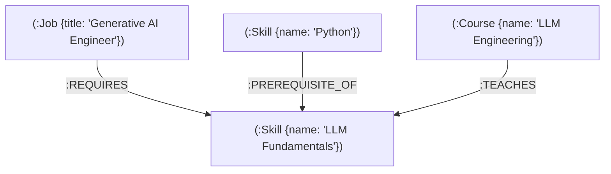

### Node Labels & Properties

| Node Label | Key Properties | Description |
|---|---|---|
| **`:Job`** | `title` *(Unique Constraint)*, `level`, `industry` | Software engineering career roles (e.g., *Backend Developer*, *Generative AI Engineer*). |
| **`:Skill`** | `name` *(Unique Constraint)*, `category`, `level` | Technical skills across 7 categories (e.g., *Python*, *React*, *Docker*, *SQL*). |
| **`:Course`** | `name` *(Unique Constraint)*, `provider`, `level`, `duration_hours` | Educational learning courses mapped to technical skills. |
| **`:Certification`** | `name` *(Unique Constraint)* | Professional certification nodes. |

### Typed Relationships

| Relationship Type | Direction | Description |
|---|---|---|
| **`:REQUIRES`** | `(:Job)-[:REQUIRES]->(:Skill)` | Maps a career role to its required technical skills. |
| **`:PREREQUISITE_OF`** | `(:Skill)-[:PREREQUISITE_OF]->(:Skill)` | Maps a foundational prerequisite skill to a downstream dependent skill. |
| **`:TEACHES`** | `(:Course)-[:TEACHES]->(:Skill)` | Maps an educational course to the specific skill it teaches. |

---

## 🗄️ Dataset & Seeding

The database is populated using idempotent `MERGE` Cypher statements defined in `scripts/seed.cypher` and executed by `scripts/seed-db.js`.

### Verified Dataset Metrics

```text
┌─────────────────────────────────────────────────────────────┐
│                 SkillPath Database Counts                   │
├──────────────────────────────┬──────────────────────────────┤
│ Jobs (:Job)                  │ 15 Software Engineering Roles│
│ Skills (:Skill)              │ 41 Technical Skills (7 Cats) │
│ Courses (:Course)            │ 28 Mapped Learning Courses   │
│ Prerequisite Edges          │ 34 PREREQUISITE_OF Edges     │
│ Requirement Edges           │ 98 REQUIRES Edges            │
│ Teaching Edges              │ 38 TEACHES Edges             │
└──────────────────────────────┴──────────────────────────────┘
```

- **15 Software Engineering Roles**: *Generative AI Engineer*, *Backend Developer*, *Frontend Developer*, *Full Stack Developer*, *DevOps Engineer*, *Data Analyst*, *Machine Learning Engineer*, *Cloud Architect*, *RAG Engineer*, *Cybersecurity Engineer*, *Database Administrator*, *Mobile Developer*, *QA Automation Engineer*, *Security Engineer*, *Data Engineer*.
- **41 Technical Skills**: Grouped into 7 categories (*Programming*, *Web Development*, *Data*, *AI/ML*, *Developer Tools*, *DevOps*, *Security*).
- **28 Mapped Courses**: Complete with duration, provider (*Coursera*, *Udemy*, *edX*), and difficulty level.

---

## 🏗️ System Architecture

SkillPath implements a clean 3-tier architecture separating presentation, REST API business logic, and native graph storage:

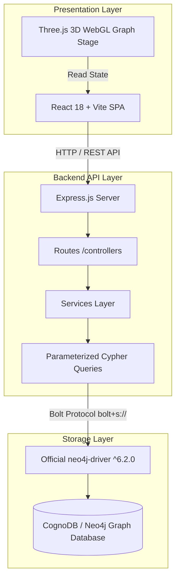

### Request boundary

```text
Browser
  │
  │ HTTPS / REST
  ▼
Render API
  │
  │ Parameterized Cypher
  ▼
CognoDB / Neo4j
```

The frontend does not connect directly to the graph database. Database credentials remain server-side in the backend environment.


---

## 🔄 End-to-End Application Flow

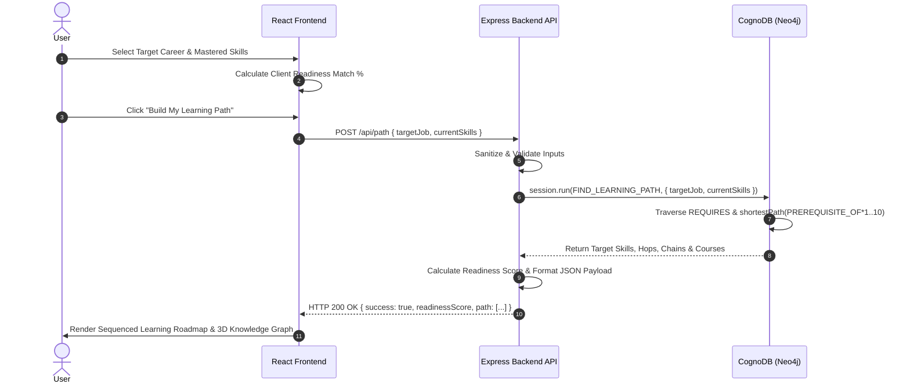

---

## ✨ Main Application Features

| Feature | Description | Implementation Details |
|---|---|---|
| **Career Planner** | 3-step interactive career planning workspace | Allows job selection, category skill toggling, and live readiness match percentage calculation. |
| **Learning Roadmap** | Sequenced prerequisite timeline | Renders step-by-step prerequisite chains, hop counts, estimated duration hours, and course cards. |
| **3D Knowledge Graph** | Interactive WebGL network graph stage | Three.js visualizer with emissive category colors, curved relationship edges, camera controls, and Node Inspector. |
| **Career Explorer** | Directory of software engineering roles | Searchable grid of 15 engineering roles with level filters, required skill chips, and planning CTA links. |
| **Skill Explorer** | Directory of technical skills | Searchable grid of 41 skills across 7 categories with mastered state toggling and roadmap generation. |
| **Course Library** | Mapped educational course directory | Displays 28 learning courses derived from `(:Course)-[:TEACHES]->(:Skill)` graph relationships. |
| **Dashboard Command Center** | System metrics & telemetry overview | Real-time CognoDB connection indicator, active job metrics, readiness gauge, and quick-start links. |

---

## 📸 Product Walkthrough & Screenshots

The repository includes an eight-screen product walkthrough under [`ScreenShots/`](https://github.com/Sumeet2005/SkillPath/tree/main/ScreenShots).

<details>
<summary><b>1. Landing Page Overview</b> — Expand</summary>

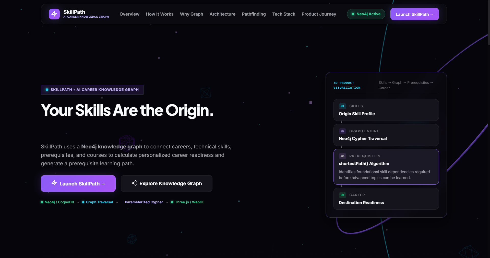

**What it demonstrates:** Product positioning, CognoDB connection status, primary navigation, and entry points into the SkillPath experience.

</details>

<details>
<summary><b>2. Dashboard Command Center</b> — Expand</summary>

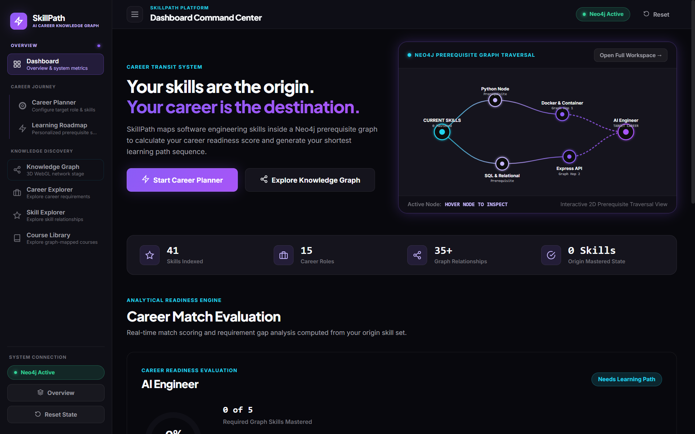

**What it demonstrates:** System overview, career readiness entry point, graph preview, and production database connection state.

</details>

<details>
<summary><b>3. Career Planner Workspace</b> — Expand</summary>

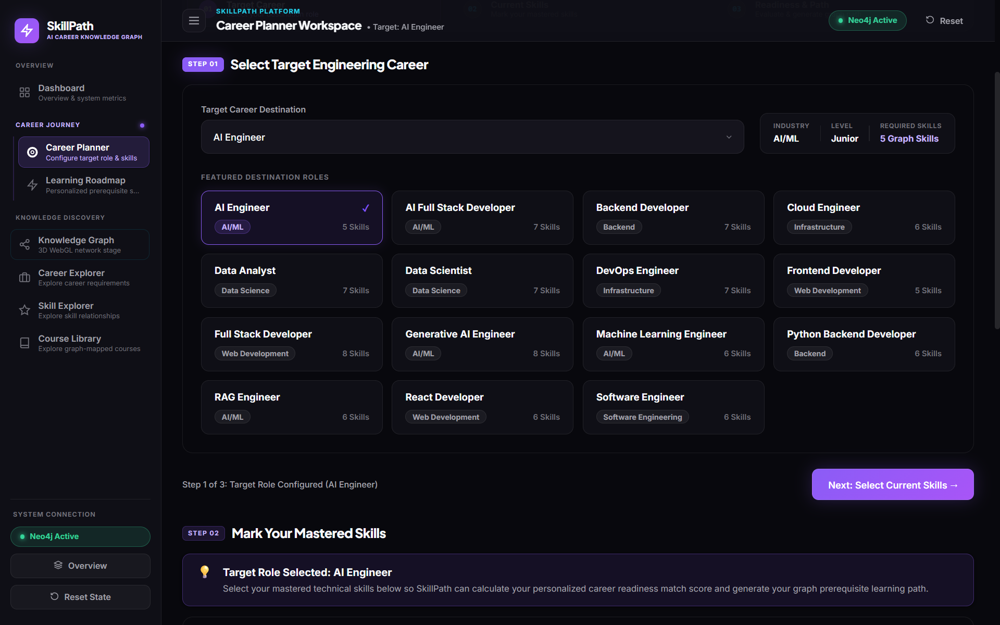

**What it demonstrates:** Target-career selection and the user's mastered-skill configuration used to build the personalized path.

</details>

<details>
<summary><b>4. Learning Roadmap</b> — Expand</summary>

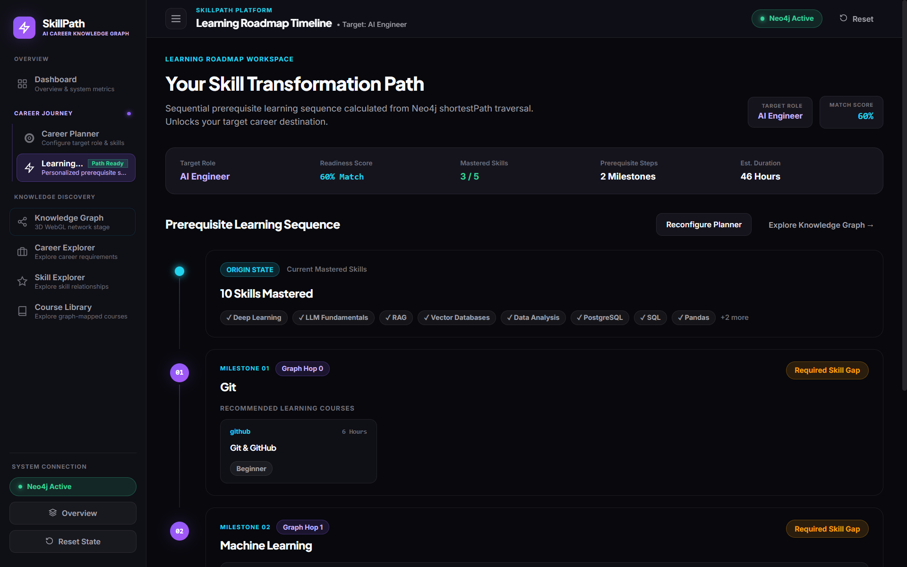

**What it demonstrates:** Graph-derived prerequisite milestones, hop counts, skill gaps, estimated duration, and mapped learning courses.

</details>

<details>
<summary><b>5. Flagship 3D WebGL Knowledge Graph</b> — Expand</summary>

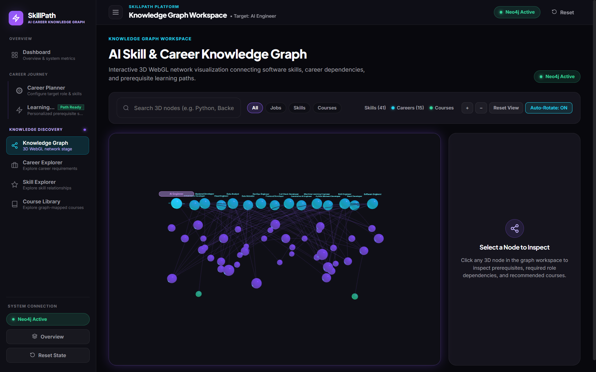

**What it demonstrates:** Interactive Three.js/WebGL exploration of career, skill, prerequisite, and course relationships.

</details>

<details>
<summary><b>6. Career Explorer Directory</b> — Expand</summary>

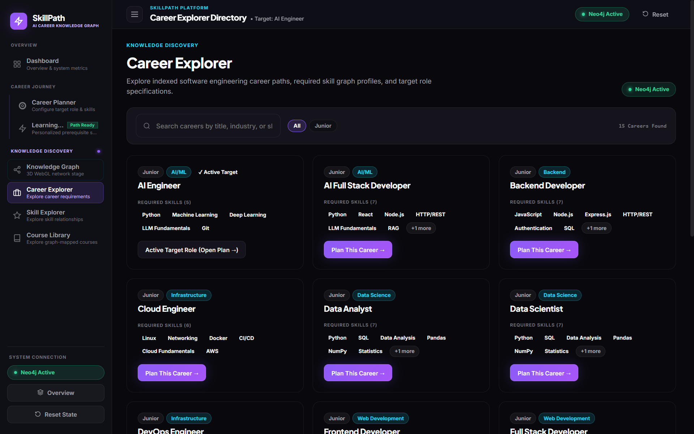

**What it demonstrates:** Searchable career-role directory with role metadata and required skill profiles.

</details>

<details>
<summary><b>7. Skill Explorer Directory</b> — Expand</summary>

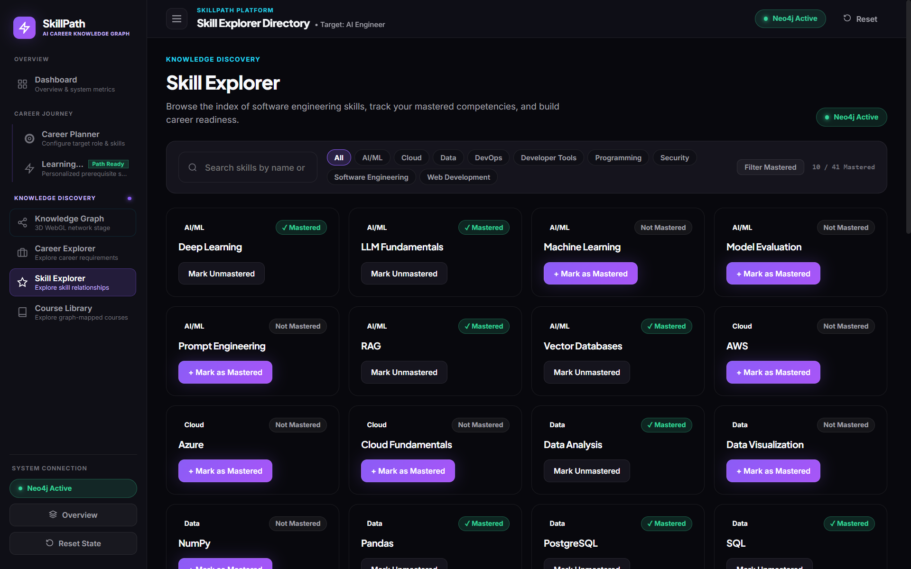

**What it demonstrates:** Searchable skill catalogue, category filtering, and mastered/unmastered state management.

</details>

<details>
<summary><b>8. Course Library Directory</b> — Expand</summary>

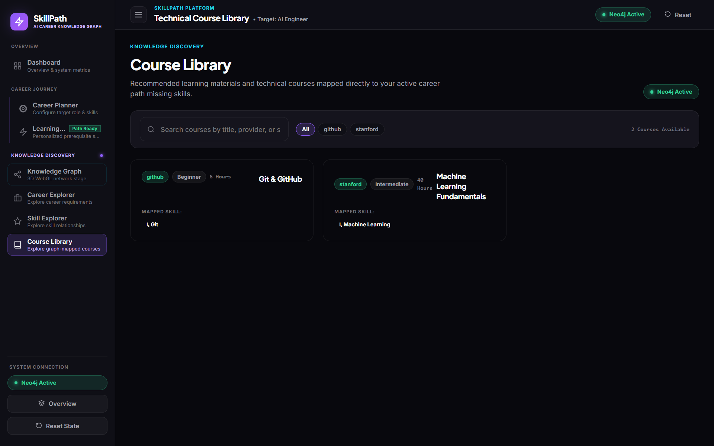

**What it demonstrates:** Course resources mapped to technical skills through graph relationships.

</details>

> **Repository note:** Keep the image filenames in `ScreenShots/` synchronized with the paths above if the screenshots are renamed.

---

## 🔍 Important Cypher Queries

All Cypher queries reside in `backend/src/queries/` and use **100% Parameterized Inputs**.

<details>
<summary><b>1. Main Pathfinding & Prerequisite Query (<code>FIND_LEARNING_PATH</code>)</b> — Click to Expand</summary>

```cypher
MATCH (j:Job {title: $targetJob})-[:REQUIRES]->(target:Skill)
WHERE NOT target.name IN $currentSkills

OPTIONAL MATCH pKnown = shortestPath((start:Skill)-[:PREREQUISITE_OF*1..10]->(target))
WHERE start.name IN $currentSkills

OPTIONAL MATCH pRoot = shortestPath((root:Skill)-[:PREREQUISITE_OF*1..10]->(target))
WHERE NOT ()-[:PREREQUISITE_OF]->(root) AND NOT root.name IN $currentSkills

OPTIONAL MATCH (anyPrereq:Skill)-[:PREREQUISITE_OF]->(target)

WITH target,
     anyPrereq IS NOT NULL AS hasPrereqs,
     CASE
       WHEN pKnown IS NOT NULL THEN pKnown
       WHEN pRoot IS NOT NULL THEN pRoot
       ELSE NULL
     END AS path

WITH target, hasPrereqs, path
ORDER BY CASE WHEN path IS NOT NULL THEN length(path) ELSE 999 END ASC

WITH target, hasPrereqs, head(collect(path)) AS bestPath

OPTIONAL MATCH (course:Course)-[:TEACHES]->(target)

RETURN
  target.name AS targetSkill,
  hasPrereqs,
  CASE
    WHEN bestPath IS NOT NULL THEN [n IN nodes(bestPath) | n.name]
    ELSE [target.name]
  END AS learningChain,
  CASE
    WHEN bestPath IS NOT NULL THEN length(bestPath)
    ELSE 0
  END AS hops,
  collect(DISTINCT {
    name: course.name,
    provider: course.provider,
    durationHours: course.duration_hours,
    level: course.level
  }) AS courses
ORDER BY hops ASC, targetSkill
```
*Located in: `backend/src/queries/learningPath.js`*
</details>

<details>
<summary><b>2. Target Job Requirements Query (<code>GET_ALL_JOBS</code>)</b> — Click to Expand</summary>

```cypher
MATCH (j:Job)
OPTIONAL MATCH (j)-[:REQUIRES]->(s:Skill)
RETURN j.title AS title, j.industry AS industry, j.level AS level, collect(s.name) AS requiredSkills
ORDER BY j.title ASC
```
*Located in: `backend/src/queries/jobs.js`*
</details>

<details>
<summary><b>3. Skills & Prerequisites Query (<code>GET_ALL_SKILLS</code>)</b> — Click to Expand</summary>

```cypher
MATCH (s:Skill)
OPTIONAL MATCH (p:Skill)-[:PREREQUISITE_OF]->(s)
RETURN s.name AS name, s.category AS category, s.level AS level, collect(p.name) AS prerequisites
ORDER BY s.category ASC, s.name ASC
```
*Located in: `backend/src/queries/skills.js`*
</details>

<details>
<summary><b>4. Course Recommendation Query (<code>GET_COURSES_BY_SKILL</code>)</b> — Click to Expand</summary>

```cypher
MATCH (c:Course)-[:TEACHES]->(s:Skill {name: $skill})
RETURN c.name AS name, c.provider AS provider, c.duration_hours AS durationHours, c.level AS level
ORDER BY c.name ASC
```
*Located in: `backend/src/queries/recommendations.js`*
</details>

---

## 🔗 Multi-Hop Graph Traversal

> **WEXA Requirement Satisfied**: Demonstrates at least one multi-hop graph traversal (2+ hops).

SkillPath evaluates prerequisite skill chains across multiple hops using variable-length relationship traversals:

```cypher
OPTIONAL MATCH pKnown = shortestPath((start:Skill)-[:PREREQUISITE_OF*1..10]->(target))
WHERE start.name IN $currentSkills
```

### Real-World 3-Hop Traversal Example:
Target Job: **Generative AI Engineer** | User Known Skills: `["Python"]`

```
(Python) ──[:PREREQUISITE_OF]──► (Machine Learning) ──[:PREREQUISITE_OF]──► (Deep Learning) ──[:PREREQUISITE_OF]──► (LLM Fundamentals)
 [Known]                              [Hop 1]                             [Hop 2]                             [Hop 3 / Target]
```

In this traversal, `LLM Fundamentals` is a required skill for *Generative AI Engineer*. The query traverses **3 relationship hops** (`*1..10`) to establish that mastering `LLM Fundamentals` requires first completing `Machine Learning` and `Deep Learning`.

---

## ⚡ Relationally Awkward Query

> **WEXA Requirement Satisfied**: Demonstrates a query that would be complex and awkward in a relational SQL database.

The `FIND_LEARNING_PATH` Cypher query executes **five distinct graph operations** in a single database roundtrip:
1. Filters required target job skills (`-[:REQUIRES]->`).
2. Excludes skills already mastered by the user (`WHERE NOT target.name IN $currentSkills`).
3. Executes a variable-length shortest path search (`shortestPath((start:Skill)-[:PREREQUISITE_OF*1..10]->(target))`).
4. Fallbacks to root skill paths if no known skill connection exists.
5. Aggregates mapped teaching courses (`(:Course)-[:TEACHES]->(:Skill)`).

### Equivalent Relational (SQL) Approach:
Achieving this in SQL requires:
- Multiple recursive Common Table Expressions (`WITH RECURSIVE prerequisite_chain AS (...)`).
- Joining `jobs`, `job_skills`, `skills`, `skill_prerequisites`, and `courses` tables.
- Pulling intermediate graphs into application memory to calculate shortest paths.

Cypher expresses this relationship chain natively in **35 lines of readable code**.

---

## 🛡️ Parameterized Cypher & Driver Security

1. **Zero Cypher Injection**: All queries pass inputs via parameter maps (`{ targetJob, currentSkills, skill }`). User inputs are never string-concatenated into Cypher statements.
2. **Official Neo4j Driver**: Uses `neo4j-driver` (`^6.2.0`) over the encrypted Bolt protocol (`bolt+s://`).
3. **Session Safety**: Every database query method creates a session inside a `try` block and guarantees closure in a `finally` block (`await session.close()`).

---

## ⚙️ CognoDB Setup & Configuration

Follow these steps to connect SkillPath to a CognoDB graph instance:

### 1. Create a CognoDB Instance
- Sign up at [CognoDB Cloud Console](https://cognodb.com).
- Create a free **C0 Neo4j-compatible database cluster**.

### 2. Save Connection Credentials
- Note your Bolt URI (`bolt+s://db-XXXXX.bravo.databases.cognodb.com`), username (`cognodb`), and generated password.

### 3. Configure Environment File
Create `backend/.env` based on `backend/.env.example`:
```ini
NEO4J_URI=bolt+s://db-XXXXX.bravo.databases.cognodb.com
NEO4J_USER=cognodb
NEO4J_PASSWORD=your_secure_password_here
PORT=5000
```

### 4. Verify Database Connection
```bash
cd backend
npm run test:db
```
*Output: `SUCCESS: Connected to CognoDB / Neo4j Graph Database!`*

### 5. Populate Seed Data
```bash
cd backend
node ../scripts/seed-db.js
```
*Populates 15 jobs, 41 skills, 28 courses, and 170+ relationship edges using idempotent `MERGE` statements.*

---

## 🔒 Environment Variables & Security

### Backend (`backend/.env`)

| Variable Name | Description | Secret? | Example |
|---|---|---|---|
| `COGNODB_URI` / `NEO4J_URI` | CognoDB Bolt Connection String | No | `bolt+s://db-XXXXX.bravo.databases.cognodb.com` |
| `COGNODB_USER` / `NEO4J_USER` | Database Username | No | `cognodb` |
| `COGNODB_PASSWORD` / `NEO4J_PASSWORD` | Database Password | **YES** | `your_secure_password_here` |
| `FRONTEND_URL` | Production Frontend CORS Origin | No | `https://skill-path-sumeet17.vercel.app` |
| `PORT` | Local Listener Port | No | `5000` |

### Security Policy:
- Credentials are loaded strictly via `process.env`.
- `.env` files are listed in `.gitignore` and never committed.
- Sample environment schemas are provided in `.env.example`.

---

## 🚨 Error Handling & Resilience

SkillPath implements centralized error handling to ensure application stability:

1. **Centralized Error Middleware** (`backend/src/middleware/errorHandler.js`): Catches async controller errors and returns structured JSON responses `{ success: false, message }` with accurate HTTP status codes (`400`, `404`, `500`). Suppresses stack traces in production.
2. **Not Found Handler** (`backend/src/middleware/notFound.js`): Intercepts unknown routes and returns a structured `404 Not Found` JSON payload.
3. **Database Health Check** (`backend/src/db/health.js`): Verifies database connectivity on startup without interrupting server initialization.

---

## 🚀 Getting Started & Local Development

### Prerequisites
- Node.js (v18.0.0 or higher)
- npm (v9.0.0 or higher)
- Active CognoDB database instance

### Step-by-Step Local Run Guide:

```bash
# 1. Clone the repository
git clone https://github.com/Sumeet2005/SkillPath.git
cd SkillPath

# 2. Install root, backend, and frontend dependencies
npm install
cd backend && npm install
cd ../frontend && npm install

# 3. Configure backend environment
cd ../backend
cp .env.example .env
# Edit backend/.env with your CognoDB credentials

# 4. Seed CognoDB database
node ../scripts/seed-db.js

# 5. Start Backend API Server (Terminal 1)
cd backend
npm run dev
# Running on http://localhost:5000

# 6. Start Frontend Application (Terminal 2)
cd frontend
npm run dev
# Running on http://localhost:5173
```

### Automated Verification Commands:
```bash
# Run Backend Readiness Test Engine
cd backend
node test-engine.js

# Run Graph Integrity Audit Script
node audit-graph.js

# Run Frontend Linter
cd ../frontend
npm run lint

# Run Frontend Production Build
npm run build
```

---

## 📁 Project Directory Structure

```text
SkillPath/
├── backend/
│   ├── src/
│   │   ├── app.js               # Express application setup & middleware assembly
│   │   ├── server.js            # Node HTTP server entry point listening on PORT
│   │   ├── config/
│   │   │   └── env.js           # Environment variable loader & validator
│   │   ├── db/
│   │   │   ├── driver.js        # Neo4j driver initialization & health helper
│   │   │   └── health.js        # Standalone database health check script
│   │   ├── middleware/
│   │   │   ├── errorHandler.js  # Centralized JSON error handling middleware
│   │   │   └── notFound.js      # 404 route catch-all handler
│   │   ├── queries/             # Parameterized Cypher query files
│   │   │   ├── courses.js
│   │   │   ├── jobs.js
│   │   │   ├── learningPath.js
│   │   │   ├── path.js
│   │   │   ├── recommendations.js
│   │   │   └── skills.js
│   │   ├── routes/              # Express route controllers
│   │   │   ├── jobs.js
│   │   │   ├── path.js
│   │   │   ├── recommendations.js
│   │   │   └── skills.js
│   │   ├── services/            # Business logic layer
│   │   │   ├── jobService.js
│   │   │   ├── pathService.js
│   │   │   ├── recommendationService.js
│   │   │   └── skillService.js
│   │   └── utils/
│   │       └── asyncHandler.js  # Async controller wrapper
│   ├── .env.example
│   ├── audit-graph.js           # Graph integrity audit script
│   ├── package.json
│   └── test-engine.js           # Readiness score & path audit engine
├── frontend/
│   ├── public/
│   │   ├── favicon.svg
│   │   └── icons.svg            # SVG icon sprite bundle
│   ├── src/
│   │   ├── components/
│   │   │   ├── graph/
│   │   │   │   ├── Ambient3DCanvas.jsx   # Three.js background canvas
│   │   │   │   ├── HeroGraph.jsx         # Interactive dashboard hero graph
│   │   │   │   └── KnowledgeGraph3D.jsx  # Flagship 3D WebGL graph visualizer
│   │   │   ├── layout/
│   │   │   │   └── Sidebar.jsx           # Collapsible sidebar & mobile drawer
│   │   │   ├── ui/                       # 12 Reusable Atomic UI Primitives
│   │   │   ├── CareerExplorer.jsx
│   │   │   ├── CareerPlanner.jsx
│   │   │   ├── CourseLibrary.jsx
│   │   │   ├── Dashboard.jsx
│   │   │   ├── Header.jsx
│   │   │   ├── KnowledgeGraph.jsx
│   │   │   ├── LandingPage.jsx
│   │   │   ├── LearningRoadmap.jsx
│   │   │   ├── ReadinessGauge.jsx
│   │   │   └── SkillExplorer.jsx
│   │   ├── hooks/
│   │   │   └── useSkillPath.js  # Custom React API state hooks
│   │   ├── services/
│   │   │   └── api.js           # Axios API client
│   │   ├── App.css              # Custom CSS Grid & Flexbox tokens
│   │   ├── App.jsx              # Main App layout & route switcher
│   │   └── main.jsx
│   ├── eslint.config.js
│   ├── index.html
│   ├── package.json
│   ├── vercel.json              # Frontend Vercel SPA rewrite config
│   └── vite.config.js           # Vite build config & proxy
├── scripts/
│   ├── seed-db.js               # Node.js database seeding script
│   └── seed.cypher              # Cypher schema constraints & dataset seed statements
├── ScreenShots/                 # 8 Application screenshots
├── .env.example
├── .gitignore
├── backend-audit.md             # Complete forensic backend audit report
├── design-system.md             # UI design system tokens & specs
├── frontend-status.md           # Deployment status report
├── package.json
└── README.md
```

## 📮 Submission Information

- **Submission Candidate**: Sumeet Sonar
- **Submission Subject**: `CognoDB Assignment 2 – Sumeet Sonar`
- **Hosted Application**: [https://skill-path-sumeet17.vercel.app](https://skill-path-sumeet17.vercel.app)
- **Demo Video Walkthrough**: [https://drive.google.com/file/d/1w97sUcgtGycr5qrmHFFkK1Q7ehiUmED5/view?usp=sharing](https://drive.google.com/file/d/1w97sUcgtGycr5qrmHFFkK1Q7ehiUmED5/view?usp=sharing)
- **GitHub Repository**: [https://github.com/Sumeet2005/SkillPath](https://github.com/Sumeet2005/SkillPath)

---

## 🔎 Final Verification

Before submission, verify these production links:

- [🚀 Live frontend](https://skill-path-sumeet17.vercel.app)
- [🩺 Backend health endpoint](https://skillpath-as6n.onrender.com/api/health)
- [💻 GitHub repository](https://github.com/Sumeet2005/SkillPath)
- [🎥 Demo video](https://drive.google.com/file/d/1w97sUcgtGycr5qrmHFFkK1Q7ehiUmED5/view?usp=sharing)

Expected health response:

```json
{
  "status": "ok",
  "success": true,
  "message": "SkillPath backend is running",
  "database": "connected"
}
```

Recommended local checks:

```bash
cd frontend
npm run lint
npm run build

cd ../backend
node test-engine.js
node audit-graph.js
```

## 📜 License

This project is licensed under the **MIT License**.
