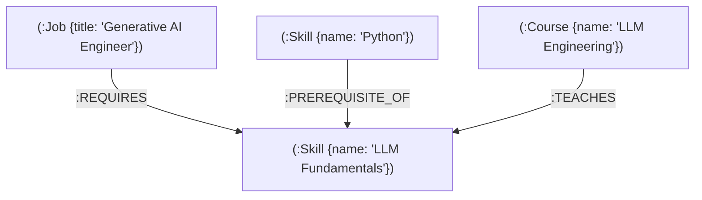

# SkillPath — AI Career Knowledge Graph

SkillPath is a graph-powered career planning platform that maps software engineering career destinations, evaluates mastered skills against target role requirements, calculates dynamic career readiness scores, resolves multi-hop prerequisite skill dependency chains, and visualizes complex technical skill networks in interactive 3D WebGL.

---

## Live Demo

[Launch SkillPath Web Application](https://skill-path-sumeet17.vercel.app)

- **Production Frontend**: [https://skill-path-sumeet17.vercel.app](https://skill-path-sumeet17.vercel.app)
- **Production Backend API**: [https://skillpath-as6n.onrender.com](https://skillpath-as6n.onrender.com)
- **API Health Check**: [https://skillpath-as6n.onrender.com/api/health](https://skillpath-as6n.onrender.com/api/health)

---

## Demo Video

[Watch the 2-Minute Video Walkthrough on Google Drive](https://drive.google.com/file/d/1w97sUcgtGycr5qrmHFFkK1Q7ehiUmED5/view?usp=sharing)

---

## GitHub Repository

[SkillPath Source Code on GitHub](https://github.com/Sumeet2005/SkillPath)

---

## Overview

SkillPath helps software developers navigate non-linear career progression. A developer selects a target engineering career (e.g., *Generative AI Engineer*, *Backend Developer*, *DevOps Engineer*) and inputs their currently mastered technical skills.

SkillPath queries a live **CognoDB / Neo4j Graph Database** over Bolt protocol using parameterized Cypher queries. It evaluates requirement coverage, calculates a career readiness percentage, identifies missing foundational prerequisite skills via shortest-path graph traversals (`shortestPath()`), and generates a step-by-step prerequisite learning roadmap with mapped educational course recommendations.

### Key Outputs Delivered to the User:
1. **Career Readiness Score**: Exact percentage match based strictly on target job skill requirements.
2. **Prerequisite Gap Analysis**: Dynamic identification of missing prerequisite skills standing between the user's current profile and target role.
3. **Sequenced Learning Roadmap**: Step-by-step chronological roadmap organizing skills by dependency order, estimated duration in hours, and unique course recommendations.
4. **Interactive 3D Knowledge Network**: Full-stage WebGL 3D network graph displaying relationships between jobs, skills, prerequisites, and courses.

---

## Problem

Modern software development requires acquiring interconnected, highly interdependent skills. Traditional career guidance platforms and learning management systems present skills as flat lists or static linear tracks.

Flat representations fail to answer critical questions:
- **Prerequisite Dependencies**: *"I want to be a Generative AI Engineer, but what foundational skills do I need before learning RAG or Vector Databases?"*
- **Optimal Learning Sequence**: *"Which missing skill should I learn first to unlock the most downstream capabilities?"*
- **Prerequisite Path Isolation**: *"Does Backend Development require HTML/CSS, or are backend prerequisites strictly isolated to server-side systems?"*
- **Course Mapping**: *"Which specific educational courses directly teach the exact missing prerequisite skills in my learning chain?"*

Relational database models (SQL) represent these relationships via join tables, but querying multi-hop prerequisite dependencies requires recursive Common Table Expressions (CTEs), multiple self-joins, and complex application-side traversal logic.

SkillPath solves this problem by modeling career intelligence natively as a **Graph Data Structure**.

---

## Why a Graph Database?

Graph databases earn their place when the core domain value lies in the **relationships between data entities** rather than standalone records.

In SkillPath, the domain model revolves around three primary entity types connected by directed relationships:

```
(:Job)    ───[:REQUIRES]────────► (:Skill)
(:Skill)  ───[:PREREQUISITE_OF]──► (:Skill)
(:Course) ───[:TEACHES]─────────► (:Skill)
```

### Relationship-Heavy Multi-Hop Questions Answered by CognoDB / Neo4j:

1. **Direct Requirement Lookup**: Which technical skills are explicitly required for a target job role?
   `MATCH (j:Job {title: $targetJob})-[:REQUIRES]->(s:Skill)`
2. **Variable-Length Prerequisite Chain Traversal**: What multi-hop prerequisite chain connects a user's known skills to a missing target skill?
   `MATCH p = shortestPath((start:Skill)-[:PREREQUISITE_OF*1..10]->(target:Skill))`
3. **Course Recommendation Mapping**: Which courses directly teach missing target or prerequisite skills?
   `MATCH (c:Course)-[:TEACHES]->(s:Skill)`

### Graph Modeling vs. Relational (SQL) Approach

| Aspect | Relational Database (SQL) | Native Graph Database (CognoDB / Neo4j) |
|---|---|---|
| **Prerequisite Modeling** | Requires recursive CTEs (`WITH RECURSIVE`), self-joins on `skill_prerequisites` join table, and multi-table joins. | Native directed relationship `(:Skill)-[:PREREQUISITE_OF]->(:Skill)` with index-free adjacency. |
| **Multi-Hop Traversal** | Query complexity and execution time grow significantly with depth; hardcoded depth limits. | Expressed naturally via variable-length Cypher patterns (`-[:PREREQUISITE_OF*1..10]->`). |
| **Shortest Path Calculation** | Requires fetching raw adjacency lists into Node.js application memory to run Dijkstra's algorithm. | Built-in Cypher engine function `shortestPath()` evaluates optimal path natively inside database memory. |
| **Schema Flexibility** | Adding new relationship semantics requires ALTER TABLE and foreign key updates. | Adding new relationship types (e.g., `:RECOMMENDS`, `:CERTIFIES`) is schema-flexible and non-breaking. |

> **Engineering Note**: Graph databases are not inherently "faster for everything" than SQL databases. However, for multi-hop graph traversals and recursive dependency chains, graph storage eliminates join table overhead and provides a far more expressive, maintainable query language (Cypher).

---

## How SkillPath Works

SkillPath guides users through a 10-step interactive workflow across 7 application screens:

```
[1. User Enters Landing Page]
           │
           ▼
[2. Select Target Career] ──► [3. Select Mastered Skills]
           │                                 │
           └─────────────────┬───────────────┘
                             ▼
              [4. Calculate Readiness Match]
                             │
                             ▼
         [5. Execute CognoDB Cypher Traversal]
                             │
                             ▼
      [6. Generate Sequenced Prerequisite Roadmap]
                             │
            ┌────────────────┴────────────────┐
            ▼                                 ▼
[7. Explore 3D Knowledge Graph]    [8. Browse Career Directory]
            │                                 │
            ▼                                 ▼
[9. Explore Skill Network]         [10. Inspect Course Library]
```

### User Journey Breakdown:
1. **Landing Page**: User lands on the workspace overview featuring real-time Neo4j status indicator and interactive hero graph.
2. **Target Career Selection**: User navigates to the **Career Planner** and selects a target engineering role (e.g., *Backend Developer*).
3. **Mastered Skill Input**: User selects technical skills they already master (e.g., *Python*, *Git*).
4. **Readiness Calculation**: SkillPath instantly calculates the exact readiness match percentage against required skills.
5. **Graph Traversal Execution**: Clicking *"Build My Learning Path"* sends a `POST /api/path` request executing multi-hop shortest-path Cypher traversals in CognoDB.
6. **Roadmap Generation**: The **Learning Roadmap** timeline renders step-by-step prerequisite chains, missing skills, estimated hours, and course recommendations.
7. **3D Knowledge Graph Exploration**: User enters the **Knowledge Graph** workspace to manipulate an interactive WebGL 3D network of jobs, skills, and courses.
8. **Career Explorer**: User reviews requirements across 15 software engineering roles in the **Career Explorer**.
9. **Skill Explorer**: User discovers 41 indexed skills across 7 category classifications in the **Skill Explorer**.
10. **Course Library**: User inspects 28 graph-mapped learning courses in the **Course Library**.

---

## Core Features

### 1. 3-Step Career Planner
Interactive workspace allowing users to select a target role, search/toggle mastered skills across 7 categories, calculate a live readiness match score, and generate a dynamic learning path.

### 2. Prerequisite Learning Roadmap
Chronological step-by-step timeline rendering origin mastered skills, intermediate prerequisite steps, target destination skills, total estimated duration in hours, and mapped course recommendations.

### 3. Flagship 3D WebGL Knowledge Graph
Full-stage Three.js / WebGL 3D interactive graph visualization with category filtering, search focus, camera controls (*Zoom In*, *Zoom Out*, *Reset View*, *Auto-Rotate*), emissive node colors, curved relationship edge lines, and a scrollable Node Inspector sidebar.

### 4. Career Explorer Directory
Searchable grid directory of 15 software engineering roles with level filters (*Junior*, *Mid-Level*, *Senior*), required skill chips, and direct planning CTA links.

### 5. Skill Explorer Directory
Searchable grid directory of 41 technical skills with category filter chips (*Programming*, *Web Development*, *Data*, *AI/ML*, *Developer Tools*, *DevOps*, *Security*), mastered state toggles, and learning path CTAs.

### 6. Curated Course Library
Graph-mapped course directory displaying 28 educational courses derived from `(:Course)-[:TEACHES]->(:Skill)` graph relationships, complete with provider, level, and duration metadata.

### 7. Dashboard Command Center
High-level command center displaying system statistics, CognoDB database status indicator, active target career telemetry, and quick-start actions.

---

## Architecture

SkillPath follows a clean 3-tier architecture separating presentation, API routing/business logic, and native graph storage:

```text
┌─────────────────────────────────────────────────────────────┐
│                    SkillPath Frontend                       │
│        React 18 + Vite + 3D WebGL (Three.js Engine)         │
│     (Dashboard, Planner, Roadmap, 3D Graph, Directories)    │
└──────────────────────────────┬──────────────────────────────┘
                               │
                               │ HTTP / REST API (JSON)
                               ▼
┌─────────────────────────────────────────────────────────────┐
│                    Express.js Backend API                   │
│      routes/   ──►   services/   ──►   queries/             │
│   (Validation)    (Business Logic)  (Parameterized Cypher)  │
└──────────────────────────────┬──────────────────────────────┘
                               │
                               │ Official neo4j-driver ^6.2.0 (Bolt Protocol)
                               ▼
┌─────────────────────────────────────────────────────────────┐
│                   CognoDB / Neo4j Graph DB                  │
│       (:Job) ──[:REQUIRES]──► (:Skill) ◄──[:TEACHES]── (:Course)
│                                 ▲                           │
│                                 └─────[:PREREQUISITE_OF]────┘
└─────────────────────────────────────────────────────────────┘
```

---

## Graph Data Model

The graph database schema models software development careers as a Directed Acyclic Graph (DAG):



### Node Labels & Properties

- **`:Job`**:
  - `title` (String, Unique Constraint) — e.g., `"Generative AI Engineer"`
  - `level` (String) — e.g., `"Senior"`
  - `industry` (String) — e.g., `"Artificial Intelligence"`
- **`:Skill`**:
  - `name` (String, Unique Constraint) — e.g., `"Python"`
  - `category` (String) — e.g., `"Programming"`, `"AI/ML"`, `"Web Development"`
  - `level` (String) — e.g., `"Beginner"`, `"Intermediate"`, `"Advanced"`
- **`:Course`**:
  - `name` (String, Unique Constraint) — e.g., `"Complete Python Bootcamp"`
  - `provider` (String) — e.g., `"Coursera"`, `"Udemy"`
  - `level` (String) — e.g., `"Beginner"`
  - `duration_hours` (Integer) — e.g., `24`
- **`:Certification`**:
  - `name` (String, Unique Constraint)

### Relationship Types

- **`(:Job)-[:REQUIRES]->(:Skill)`**: Connects a career role to its required technical skills.
- **`(:Skill)-[:PREREQUISITE_OF]->(:Skill)`**: Connects foundational skills to downstream dependent skills.
- **`(:Course)-[:TEACHES]->(:Skill)`**: Maps educational courses to the specific skills they teach.

---

## Seed Data

The database is seeded via `scripts/seed-db.js` using idempotent `MERGE` statements defined in `scripts/seed.cypher`.

### Seed Dataset Audit Metrics

| Metric | Count | Details |
|---|---|---|
| **Jobs (`:Job`)** | **15** | *Generative AI Engineer*, *Backend Developer*, *Frontend Developer*, *Full Stack Developer*, *DevOps Engineer*, *Data Analyst*, *Machine Learning Engineer*, *Cloud Architect*, *RAG Engineer*, *Cybersecurity Engineer*, etc. |
| **Skills (`:Skill`)** | **41** | Spanning 7 categories: *Programming*, *Web Development*, *Data*, *AI/ML*, *Developer Tools*, *DevOps*, *Security*. |
| **Courses (`:Course`)** | **28** | Structured educational courses with duration and provider metadata. |
| **Prerequisite Edges (`:PREREQUISITE_OF`)** | **34** | Directed prerequisite dependencies forming an acyclic dependency graph. |
| **Requirement Edges (`:REQUIRES`)** | **98** | Career-to-skill requirement mappings. |
| **Teaching Edges (`:TEACHES`)** | **38** | Course-to-skill coverage mappings. |

---

## Graph Queries

All database interactions use **100% Parameterized Cypher Queries** located in `backend/src/queries/`.

### 1. Main Path Calculation Query (`FIND_LEARNING_PATH`)
Located in `backend/src/queries/learningPath.js`:

```cypher
MATCH (j:Job {title: $targetJob})-[:REQUIRES]->(target:Skill)
WHERE NOT target.name IN $currentSkills

OPTIONAL MATCH pKnown = shortestPath((start:Skill)-[:PREREQUISITE_OF*1..10]->(target))
WHERE start.name IN $currentSkills

OPTIONAL MATCH pRoot = shortestPath((root:Skill)-[:PREREQUISITE_OF*1..10]->(target))
WHERE NOT ()-[:PREREQUISITE_OF]->(root) AND NOT root.name IN $currentSkills

OPTIONAL MATCH (anyPrereq:Skill)-[:PREREQUISITE_OF]->(target)

WITH target,
     anyPrereq IS NOT NULL AS hasPrereqs,
     CASE
       WHEN pKnown IS NOT NULL THEN pKnown
       WHEN pRoot IS NOT NULL THEN pRoot
       ELSE NULL
     END AS path

WITH target, hasPrereqs, path
ORDER BY CASE WHEN path IS NOT NULL THEN length(path) ELSE 999 END ASC

WITH target, hasPrereqs, head(collect(path)) AS bestPath

OPTIONAL MATCH (course:Course)-[:TEACHES]->(target)

RETURN
  target.name AS targetSkill,
  hasPrereqs,
  CASE
    WHEN bestPath IS NOT NULL THEN [n IN nodes(bestPath) | n.name]
    ELSE [target.name]
  END AS learningChain,
  CASE
    WHEN bestPath IS NOT NULL THEN length(bestPath)
    ELSE 0
  END AS hops,
  collect(DISTINCT {
    name: course.name,
    provider: course.provider,
    durationHours: course.duration_hours,
    level: course.level
  }) AS courses
ORDER BY hops ASC, targetSkill
```

### 2. Fetch Job Roles Query (`GET_ALL_JOBS`)
Located in `backend/src/queries/jobs.js`:

```cypher
MATCH (j:Job)
OPTIONAL MATCH (j)-[:REQUIRES]->(s:Skill)
RETURN j.title AS title, j.industry AS industry, j.level AS level, collect(s.name) AS requiredSkills
ORDER BY j.title ASC
```

### 3. Fetch Skills Directory Query (`GET_ALL_SKILLS`)
Located in `backend/src/queries/skills.js`:

```cypher
MATCH (s:Skill)
OPTIONAL MATCH (p:Skill)-[:PREREQUISITE_OF]->(s)
RETURN s.name AS name, s.category AS category, s.level AS level, collect(p.name) AS prerequisites
ORDER BY s.category ASC, s.name ASC
```

### 4. Course Recommendation Query (`GET_COURSES_BY_SKILL`)
Located in `backend/src/queries/recommendations.js`:

```cypher
MATCH (c:Course)-[:TEACHES]->(s:Skill {name: $skill})
RETURN c.name AS name, c.provider AS provider, c.duration_hours AS durationHours, c.level AS level
ORDER BY c.name ASC
```

---

## API

All endpoints return structured JSON responses with HTTP status codes (`200 OK`, `400 Bad Request`, `404 Not Found`, `500 Internal Server Error`).

| Method | Endpoint | Description | Payload / Parameters |
|---|---|---|---|
| `GET` | `/api/health` | Backend and CognoDB database status check | None |
| `GET` | `/api/jobs` | Retrieve all 15 indexed target engineering jobs | None |
| `GET` | `/api/skills` | Retrieve all 41 indexed technical skills with categories | None |
| `POST` | `/api/path` | Calculate readiness score, missing skills & roadmap | Body: `{ "targetJob": "Backend Developer", "currentSkills": ["Python", "Git"] }` |
| `GET` | `/api/recommendations` | Retrieve courses that teach a specific skill | Query: `?skill=Python` |

---

## Project Structure

```text
SkillPath/
├── backend/
│   ├── src/
│   │   ├── app.js               # Express app, middleware assembly & CORS policy
│   │   ├── server.js            # Node HTTP server entry point listening on PORT
│   │   ├── config/
│   │   │   └── env.js           # Environment variable validation (NEO4J_URI/USER/PASSWORD)
│   │   ├── db/
│   │   │   ├── driver.js        # Neo4j driver initialization & health check helper
│   │   │   └── health.js        # Standalone database connectivity check script
│   │   ├── middleware/
│   │   │   ├── errorHandler.js  # Centralized JSON error handling middleware
│   │   │   └── notFound.js      # 404 route catch-all handler
│   │   ├── queries/             # Modularized parameterized Cypher queries
│   │   │   ├── jobs.js
│   │   │   ├── skills.js
│   │   │   ├── learningPath.js
│   │   │   ├── courses.js
│   │   │   └── recommendations.js
│   │   ├── routes/              # Express route controllers
│   │   │   ├── jobs.js
│   │   │   ├── path.js
│   │   │   ├── recommendations.js
│   │   │   └── skills.js
│   │   ├── services/            # Business logic layer
│   │   │   ├── jobService.js
│   │   │   ├── pathService.js
│   │   │   ├── recommendationService.js
│   │   │   └── skillService.js
│   │   └── utils/
│   │       └── asyncHandler.js  # Controller promise wrapper
│   ├── .env.example
│   ├── audit-graph.js           # Graph integrity audit script (cycles, dupes, unmapped)
│   ├── package.json
│   └── test-engine.js           # Readiness score & path audit test engine
├── frontend/
│   ├── public/
│   │   ├── favicon.svg
│   │   └── icons.svg            # SVG sprite bundle
│   ├── src/
│   │   ├── components/
│   │   │   ├── graph/
│   │   │   │   ├── Ambient3DCanvas.jsx   # Three.js background canvas
│   │   │   │   ├── HeroGraph.jsx         # Interactive dashboard hero graph
│   │   │   │   └── KnowledgeGraph3D.jsx  # Flagship 3D WebGL graph visualizer
│   │   │   ├── layout/
│   │   │   │   └── Sidebar.jsx           # Collapsible desktop sidebar & mobile drawer
│   │   │   ├── ui/                       # 12 Atomic UI Primitives
│   │   │   │   ├── Badge.jsx
│   │   │   │   ├── Button.jsx
│   │   │   │   ├── Card.jsx
│   │   │   │   ├── HowItWorks.jsx
│   │   │   │   ├── Input.jsx
│   │   │   │   ├── Modal.jsx
│   │   │   │   ├── SearchInput.jsx
│   │   │   │   ├── SectionHeader.jsx
│   │   │   │   ├── Select.jsx
│   │   │   │   ├── Stat.jsx
│   │   │   │   ├── StatusIndicator.jsx
│   │   │   │   └── Tabs.jsx
│   │   │   ├── CareerExplorer.jsx
│   │   │   ├── CareerPlanner.jsx
│   │   │   ├── CourseLibrary.jsx
│   │   │   ├── Dashboard.jsx
│   │   │   ├── Header.jsx
│   │   │   ├── KnowledgeGraph.jsx
│   │   │   ├── LandingPage.jsx
│   │   │   ├── LearningRoadmap.jsx
│   │   │   ├── ReadinessGauge.jsx
│   │   │   └── SkillExplorer.jsx
│   │   ├── hooks/
│   │   │   └── useSkillPath.js  # React state management & API hooks
│   │   ├── services/
│   │   │   └── api.js           # Axios API client setup
│   │   ├── App.css              # Custom CSS Grid / Flexbox tokens
│   │   ├── App.jsx              # Main App layout & route controller
│   │   ├── index.css            # Tailwind / Global CSS reset
│   │   └── main.jsx             # React DOM entry point
│   ├── eslint.config.js
│   ├── index.html
│   ├── package.json
│   ├── vercel.json              # Frontend SPA rewrite rules
│   └── vite.config.js           # Vite build config & dev server proxy
├── scripts/
│   ├── seed-db.js               # Node.js seed loading script
│   └── seed.cypher              # Cypher schema constraints & dataset seed statements
├── ScreenShots/                 # 8 Application screenshots
│   ├── career-explorer.png
│   ├── career-planner.png
│   ├── course-library.png
│   ├── dashboard.png
│   ├── knowledge-graph.png
│   ├── landing-page.png
│   ├── learning-roadmap.png
│   └── skill-explorer.png
├── .env.example
├── .gitignore
├── backend-audit.md
├── design-system.md
├── frontend-status.md
├── package.json
├── README.md
└── vercel.json
```

---

## CognoDB Setup

SkillPath connects to CognoDB (or any Neo4j instance) via the official `neo4j-driver` using the secure Bolt protocol (`bolt+s://`).

### Step-by-Step CognoDB Configuration:

1. **Create a CognoDB Account & Instance**:
   - Log into [CognoDB Cloud Console](https://cognodb.com).
   - Create a new Neo4j-compatible database cluster.
   - Copy your connection Bolt URI (e.g., `bolt+s://db-7e0164c6.bravo.databases.cognodb.com`), username (`cognodb`), and generated password.

2. **Configure Environment Variables**:
   - Create `backend/.env` based on `backend/.env.example`:
     ```ini
     NEO4J_URI=bolt+s://db-7e0164c6.bravo.databases.cognodb.com
     NEO4J_USER=cognodb
     NEO4J_PASSWORD=your_actual_password_here
     PORT=5000
     ```

3. **Verify Database Connection**:
   - Run the backend database test script:
     ```bash
     cd backend
     npm run test:db
     ```
   - Successful output: `SUCCESS: Connected to CognoDB / Neo4j Graph Database!`

4. **Seed Schema & Graph Dataset**:
   - Execute the seed loading script from the backend workspace directory:
     ```bash
     cd backend
     node ../scripts/seed-db.js
     ```
   - This script connects to your CognoDB instance, creates unique constraints on `:Job(title)`, `:Skill(name)`, `:Course(name)`, and `:Certification(name)`, and populates all 15 jobs, 41 skills, 28 courses, and 170+ relationship edges using idempotent `MERGE` statements.

---

## Environment Variables

### Backend (`backend/.env`)

| Environment Variable | Description | Required | Example |
|---|---|---|---|
| `COGNODB_URI` / `NEO4J_URI` | CognoDB / Neo4j Bolt connection URI | **YES** | `bolt+s://db-7e0164c6.bravo.databases.cognodb.com` |
| `COGNODB_USER` / `NEO4J_USER` | CognoDB database user | **YES** | `cognodb` |
| `COGNODB_PASSWORD` / `NEO4J_PASSWORD` | CognoDB instance password | **YES** | `your_secure_password` |
| `FRONTEND_URL` | Deployed frontend URL for CORS | NO | `https://skill-path-sumeet17.vercel.app` |
| `PORT` | Local Express listener port | NO (Default: 5000) | `5000` |

### Frontend (`frontend/.env`)

| Environment Variable | Description | Required | Example |
|---|---|---|---|
| `VITE_API_BASE_URL` | Render backend API base URL | NO (Default: "") | `https://skillpath-as6n.onrender.com` |

> **Security Mandate**: Sensitive credentials (`NEO4J_PASSWORD`) are loaded strictly from environment variables. `.env` files are ignored in `.gitignore` and never committed.

---

## Running Locally

### Prerequisites
- Node.js (v18.0.0 or higher)
- npm (v9.0.0 or higher)
- Active CognoDB database instance or local Neo4j instance

### Step-by-Step Local Run Guide:

1. **Clone the Repository**:
   ```bash
   git clone https://github.com/Sumeet2005/SkillPath.git
   cd SkillPath
   ```

2. **Install Dependencies**:
   ```bash
   # Install root dependencies
   npm install

   # Install backend dependencies
   cd backend
   npm install

   # Install frontend dependencies
   cd ../frontend
   npm install
   ```

3. **Set Up Backend Environment File**:
   Create `backend/.env` and add your CognoDB credentials:
   ```ini
   NEO4J_URI=bolt+s://your-cognodb-instance.cognodb.com
   NEO4J_USER=cognodb
   NEO4J_PASSWORD=your_password
   PORT=5000
   ```

4. **Seed Database**:
   ```bash
   cd backend
   node ../scripts/seed-db.js
   ```

5. **Start Servers**:
   - **Terminal 1: Start Backend API**
     ```bash
     cd backend
     npm run dev
     ```
     *Backend running at http://localhost:5000*

   - **Terminal 2: Start Frontend Web App**
     ```bash
     cd frontend
     npm run dev
     ```
     *Frontend running at http://localhost:5173 (or http://localhost:5174)*

6. **Open in Browser**:
   Navigate to `http://localhost:5173` to interact with SkillPath.

---

## Screenshots

### 1. Landing Page Overview


### 2. Dashboard Command Center


### 3. Career Planner Workspace


### 4. Prerequisite Learning Roadmap


### 5. Flagship 3D WebGL Knowledge Graph


### 6. Career Explorer Directory


### 7. Skill Explorer Directory


### 8. Course Library


---

## Testing & Verification

SkillPath contains automated test suites and validation scripts ensuring database health, query correctness, and frontend code quality:

### 1. Backend Readiness Score & Pathfinding Audit Suite
Runs 12 career and skill combination test cases against CognoDB Neo4j database:
```bash
cd backend
node test-engine.js
```
*Expected Output: `V2 READINESS SCORE AUDIT COMPLETED!` (Exit Code: 0)*

### 2. Graph Integrity Audit Script
Checks for graph cycles, duplicate relationship edges, and unmapped skills:
```bash
cd backend
node audit-graph.js
```
*Expected Output: `0 Duplicate Relationships, 0 Graph Cycles, 15 Validated Jobs`*

### 3. Database Connectivity Verification
```bash
cd backend
npm run test:db
```

### 4. Frontend Code Quality & ESLint Checks
```bash
cd frontend
npm run lint
```
*Expected Output: `0 errors, 0 warnings`*

### 5. Production Build Verification
```bash
cd frontend
npm run build
```
*Expected Output: `✓ built in 272ms`*

---

## Engineering & Security

1. **100% Parameterized Cypher Queries**: All Neo4j queries pass variables via parameter maps (`{ targetJob, currentSkills, skill }`), completely eliminating Cypher injection vulnerabilities.
2. **Environment Credential Isolation**: Database credentials (`NEO4J_URI`, `NEO4J_USER`, `NEO4J_PASSWORD`) are loaded strictly from `process.env` and validated at backend startup (`src/config/env.js`). Zero hardcoded secrets exist in source code.
3. **Centralized Error Middleware**: Custom Express error handler middleware (`src/middleware/errorHandler.js`) catches async errors, suppresses internal stack traces in production, and formats standardized JSON error responses `{ success: false, message }`.
4. **Driver Session Management**: Every database service method instantiates a Neo4j session within a `try` block and guarantees session cleanup in a `finally { await session.close(); }` block to prevent session leaks.
5. **CORS Policy Security**: Express CORS middleware enforces domain origin restrictions in production via `FRONTEND_URL`.

---

## WEXA Assignment Alignment

| WEXA Requirement | Implementation Evidence |
|---|---|
| **A. Use Case** | SkillPath graph-powered career planning & prerequisite roadmap engine. |
| **B. Why Graph Database?** | Dedicated section detailing multi-hop traversals, `shortestPath()`, and comparison with relational SQL. |
| **C. Thoughtful Graph Data Model** | Labeled nodes (`Job`, `Skill`, `Course`), typed relationships (`REQUIRES`, `PREREQUISITE_OF`, `TEACHES`), properties, and constraints. |
| **D. Data Model Diagram** | Included in Section: *Graph Data Model* using Mermaid syntax. |
| **E. Real/Realistic Seed Data** | 15 Jobs, 41 Skills, 28 Courses, 34 Prerequisite edges, 98 Requirement edges, 38 Teaches edges populated via `seed.cypher`. |
| **F. Setup & Run Instructions** | Comprehensive local run instructions provided in Section: *Running Locally*. |
| **G. CognoDB Instance Setup** | Dedicated step-by-step CognoDB cluster setup guide in Section: *CognoDB Setup*. |
| **H. Main Cypher Queries** | Documented Cypher queries (`FIND_LEARNING_PATH`, `GET_ALL_JOBS`, `GET_ALL_SKILLS`, `GET_COURSES_BY_SKILL`). |
| **I. UI Screenshots** | 8 embedded application screenshots in Section: *Screenshots*. |
| **J. Project Structure** | Complete ASCII tree representation matching repository layout. |
| **K. Hosted App Link** | Live Vercel App Link: [https://skill-path-sumeet17.vercel.app](https://skill-path-sumeet17.vercel.app) |
| **L. Video Recording Link** | Google Drive Video Link: [https://drive.google.com/file/d/1w97sUcgtGycr5qrmHFFkK1Q7ehiUmED5/view?usp=sharing](https://drive.google.com/file/d/1w97sUcgtGycr5qrmHFFkK1Q7ehiUmED5/view?usp=sharing) |
| **M. Env Variable Security** | Credentials strictly stored in `.env` files ignored by `.gitignore`. |
| **N. Database Error Handling** | Centralized Express error handler returning structured HTTP status codes. |
| **O. Clear Architecture** | 3-tier architecture diagram (React + Vite Frontend → Express Backend → CognoDB). |
| **P. Functional Web App** | Fully interactive web app running on Vercel + Render + CognoDB. |

---

## Recommended Demo Flow

For WEXA evaluators reviewing SkillPath:

1. **Open Live App**: Go to [https://skill-path-sumeet17.vercel.app](https://skill-path-sumeet17.vercel.app).
2. **Verify Database Health**: Check the status badge in the top right (`Neo4j Active` / `CognoDB Online`).
3. **Navigate to Career Planner**: Click *"Career Planner"* in the left sidebar.
4. **Select Target Career**: Choose `"Generative AI Engineer"`.
5. **Select Known Skills**: Toggle `"Python"` and `"Machine Learning"`.
6. **Generate Learning Path**: Click *"Build My Learning Path"*. Observe the instant readiness match score update (**25%**).
7. **Inspect Learning Roadmap**: Review the generated prerequisite sequence timeline showing downstream steps (*Deep Learning* → *LLM Fundamentals* → *Prompt Engineering* → *Vector Databases* → *RAG* → *Model Evaluation*) along with mapped course cards.
8. **Explore 3D Knowledge Graph**: Click *"Knowledge Graph"* in the sidebar. Orbit, zoom, filter categories, and click any node to open the Node Inspector sidebar.
9. **Browse Explorer Directories**: Inspect *"Career Explorer"*, *"Skill Explorer"*, and *"Course Library"*.

---

## Future Improvements

1. **User Profile Persistence**: Save user skill profiles, target roles, and roadmap progress to authenticated user accounts.
2. **Dynamic Skill Weighting**: Allow users to mark skills as *"Beginner"*, *"Intermediate"*, or *"Advanced"* to calculate weighted readiness scores.
3. **Expanded Graph Constraints**: Add multi-role overlap analytics identifying skills that unlock the highest number of alternative engineering roles.

---

## License

This project is licensed under the **MIT License**.
